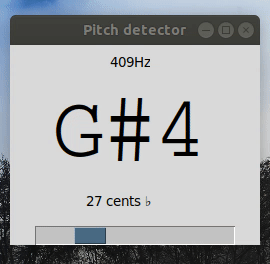

# Python-Pitch-Detector

This application is aimed to detect the music note when a sound is played to it.

The app uses pyaudio for processing audio. fft function of numpy module to detect the frequency and tkinter for GUI.

**Demo:**

The GUI shows the detected frequency, Nearest musical note and octave, by how many cents the sound is in detune to the displayed note and a visual representation of the detune amount.

**How to run:**

Install the require modules using ``pip3 install -r requirements.txt``

After successful installation, launch the app with the command ``python3 detector.py``

FFT reference: spectrum analyzer by sbarratt

Note conversion logic: PitchDetect by markmarijnissen
